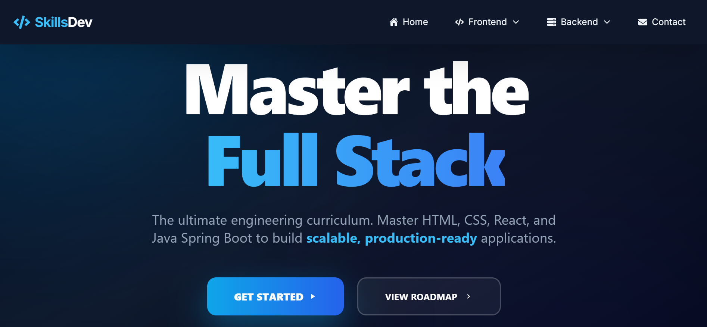
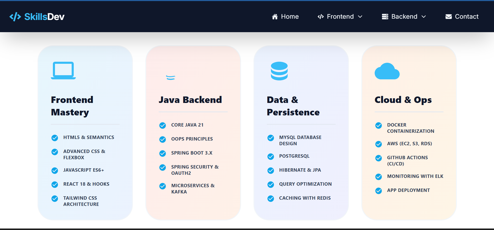
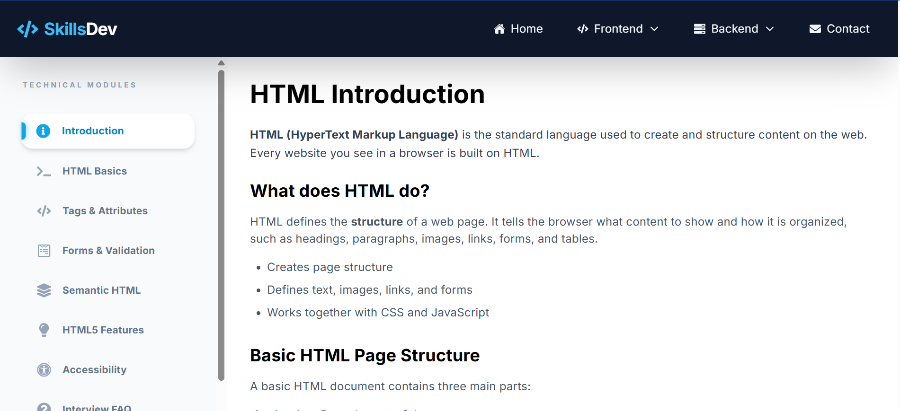
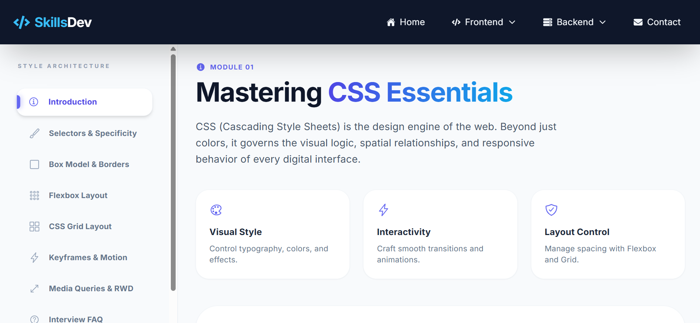
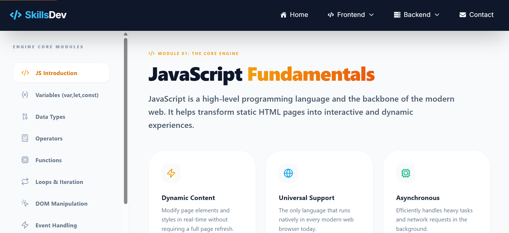
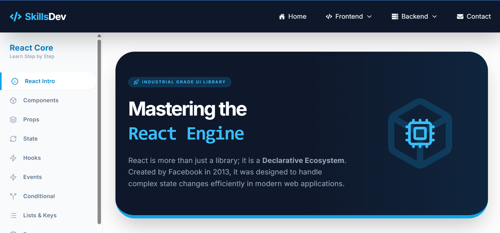
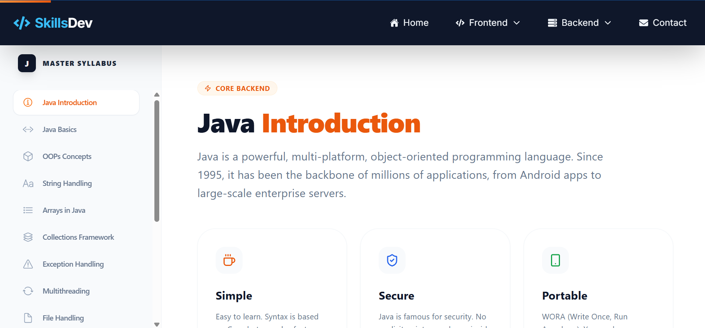
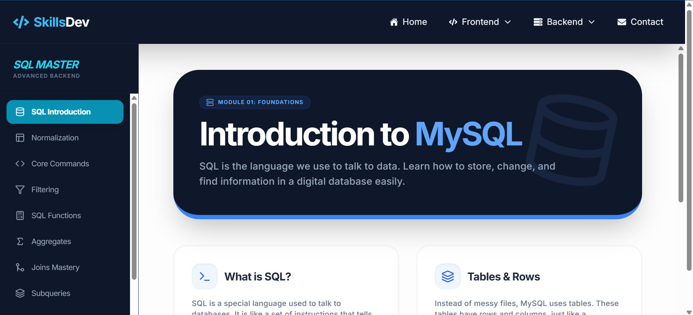
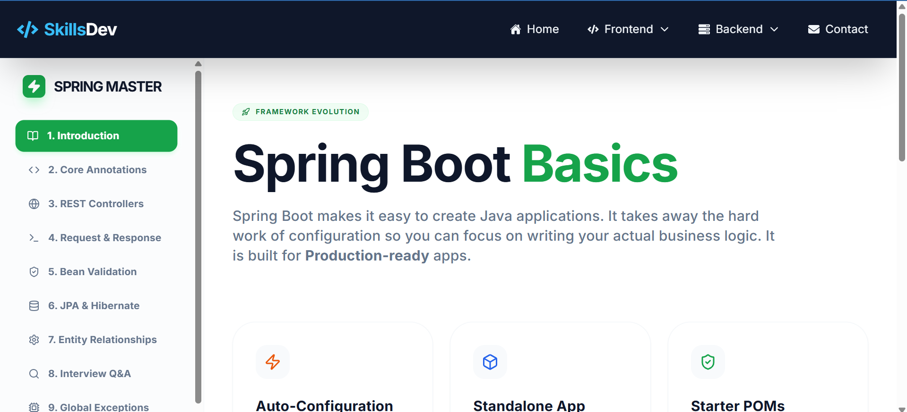
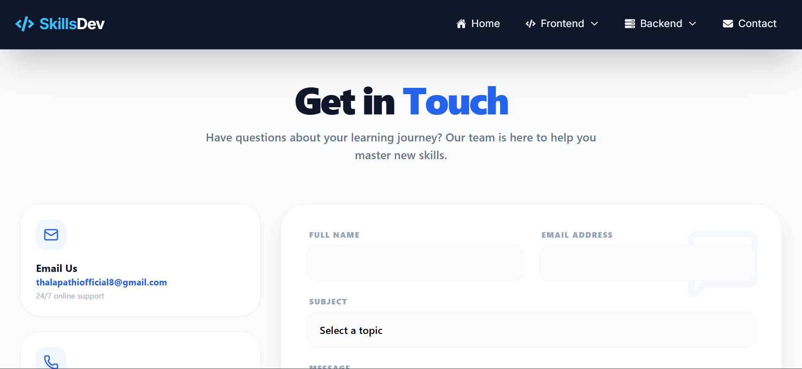

# 🚀 DevPath – Full Stack Skill Development Platform

A structured, self-paced skill development platform focused on building strong fundamentals and interview-ready full-stack developers.

---

## 🎯 Overview

**DevPath** is a modern, comprehensive learning platform designed to transform beginners into job-ready full-stack developers. Unlike fragmented online tutorials, DevPath provides a structured, progressive learning experience with a focus on:

- 🎓 **Concept Clarity** – Deep understanding over memorization
- 📈 **Progressive Learning** – Step-by-step skill building
- 💼 **Interview Preparation** – Real-world questions and solutions
- 🎨 **Clean UX/UI** – Distraction-free, focused learning environment
- 🔄 **Self-Paced** – Learn at your own speed

### 🌟 Why DevPath?

| Problem | DevPath Solution |
|---------|------------------|
| Scattered learning resources | Unified, structured curriculum |
| No clear learning path | Technology-specific roadmaps |
| Theory without practice | Hands-on examples with explanations |
| Lack of interview prep | Integrated interview questions per topic |
| Overwhelming content | Progressive, beginner-friendly modules |

---

## ✨ Key Features

### 📚 Comprehensive Learning Modules

<details>
<summary><b>Frontend Technologies</b></summary>

- **HTML5** – Semantic markup, forms, accessibility
- **CSS3** – Layouts, animations, responsive design
- **JavaScript (ES6+)** – Modern syntax, async programming, DOM manipulation
- **React.js** – Components, hooks, state management, routing

</details>

<details>
<summary><b>Backend Technologies</b></summary>

- **Java** – OOP principles, collections, exception handling
- **Spring Boot** – REST APIs, dependency injection, security
- **MySQL** – Database design, queries, relationships, optimization

</details>

### 🎯 Core Platform Features

- ✅ **Structured Curriculum** – Follow clear learning paths for each technology
- ✅ **Topic Navigation** – Intuitive sidebar for easy module access
- ✅ **Interview Questions** – Curated questions with detailed explanations
- ✅ **Responsive Design** – Seamless experience across all devices
- ✅ **Fast Performance** – Lightning-fast load times with Vite
- ✅ **Progress Tracking** – (Coming Soon) Track your learning journey
- ✅ **Code Playground** – (Planned) Practice coding directly in the browser

---

## 🛠 Tech Stack

### Frontend

```
React 18.x          → UI Library
JavaScript (ES6+)   → Programming Language
Tailwind CSS        → Utility-first Styling
Vite 5.x           → Build Tool & Dev Server
React Router        → Client-side Routing
```


## 📌 About the Project

DevPath is a learning-focused web application designed to help students and aspiring developers master full-stack technologies through a clear, structured roadmap.

Unlike scattered tutorials, this platform emphasizes:
- Concept clarity
- Progressive learning
- Interview preparation
- Clean and distraction-free UI

---

## 🎯 Goals

- Provide a single platform for end-to-end full-stack learning
- Help learners transition from basics to job-ready skills
- Combine theory, examples, and interview questions
- Encourage self-paced, structured learning

---

## 🛠 Tech Stack

### Frontend
- React.js
- JavaScript (ES6+)
- Tailwind CSS
- Vite

### Backend (Planned / In Progress)
- Java
- Spring Boot
- REST APIs

### Database
- MySQL

---


---

## 🖥 Screenshots

> Replace the image paths with your own screenshots

## 🏠 Home


The Home page introduces the Skill Development Platform.  
It gives users a clear idea of what the website offers and how to begin learning.  
Navigation is simple so users can move to any technology roadmap easily.


## 🗺️ Roadmap


The Roadmap page provides a structured learning path for each technology.  
It helps learners understand what to study first and what to learn next.  
This avoids confusion and supports step-by-step skill development.


## 🌐 HTML


The HTML page covers the fundamentals of web structure.  
It explains tags, elements, forms, and semantic HTML.  
This section helps beginners build the base for web development.


## 🎨 CSS


The CSS page focuses on styling and layout design.  
It includes topics like box model, flexbox, grid, and animations.  
Users learn how to create responsive and visually appealing web pages.

## ⚙️ JavaScript


The JavaScript page explains how to add logic and interactivity to websites.  
It covers variables, functions, events, and execution concepts.  
This section helps users understand how websites behave dynamically.

## ⚛️ React


The React page focuses on building modern user interfaces.  
It explains components, state, props, hooks, and rendering behavior.  
This helps users develop scalable and efficient frontend applications.

## ☕ Java


The Java page explains core Java concepts and object-oriented programming.  
It includes classes, objects, inheritance, and collections.  
This section builds a strong foundation for backend development.

## 🗄️ SQL


The SQL page focuses on database concepts and queries.  
It covers tables, relationships, CRUD operations, and joins.  
Users learn how to store and retrieve data efficiently.

## 🚀 Spring Boot


The Spring Boot page explains backend application development.  
It covers REST APIs, controllers, services, and database integration.  
This helps users build secure and scalable backend systems.

## 📞 Contact


The Contact page allows users to reach out for queries or feedback.  
It provides communication details for support and collaboration.  
This page helps maintain interaction between users and the platform.

---


"# Skill-Development-Website" 
